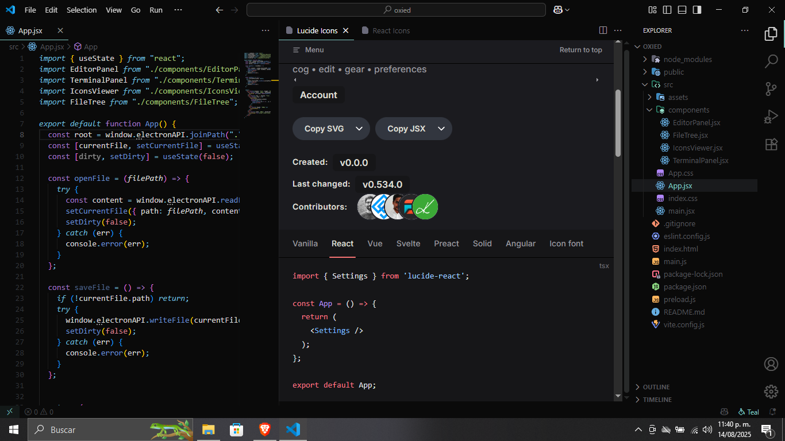

# Icons Viewer

Extensión de VSCode para abrir páginas de librerías de iconos directamente en el editor, sin tener que salir a un navegador externo.

## 🔗 Descarga Aquí:

https://marketplace.visualstudio.com/items?itemName=KevDev35.icons-viewer&ssr=false#overview

## 🚀 Cómo usar
1. Presiona `Ctrl+Shift+P` (o `Cmd+Shift+P` en Mac).
2. Busca el comando: **"Abrir Icons Viewer"**.
3. Selecciona la librería de iconos.
4. Disfruta buscándolos directamente en VSCode.

## 📌 Librerías soportadas
- React Icons
- Lucide Icons
- Heroicons
- Tabler Icons

